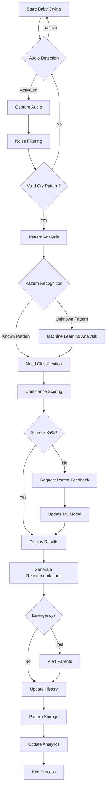
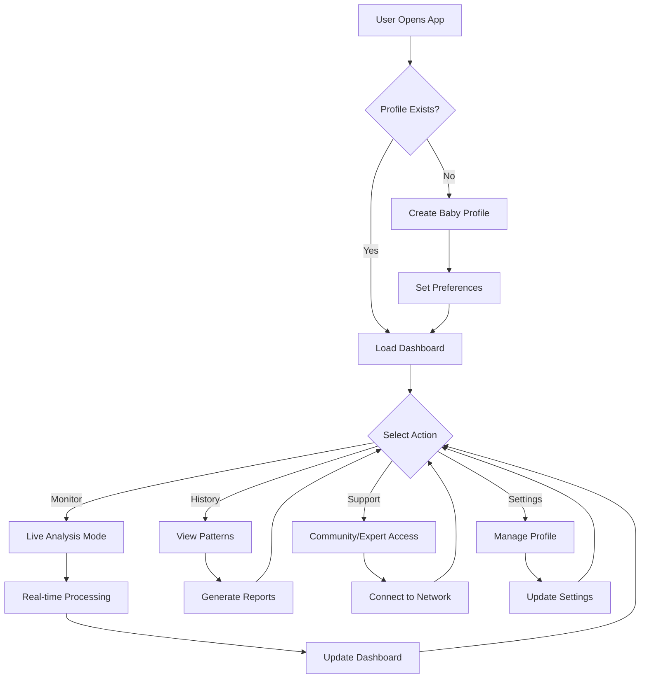
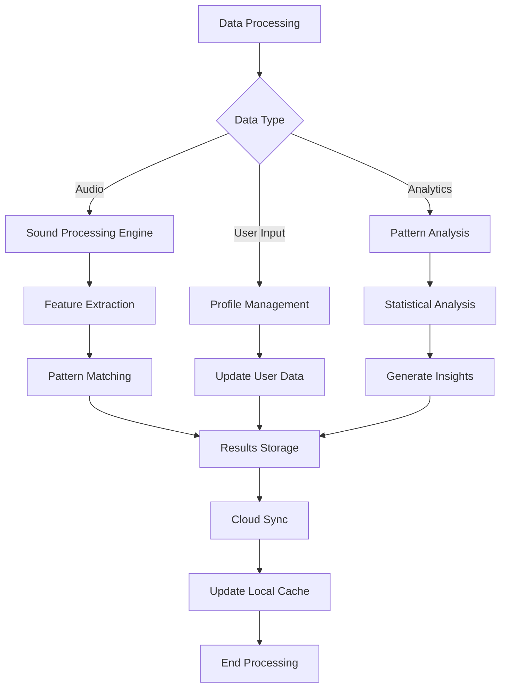
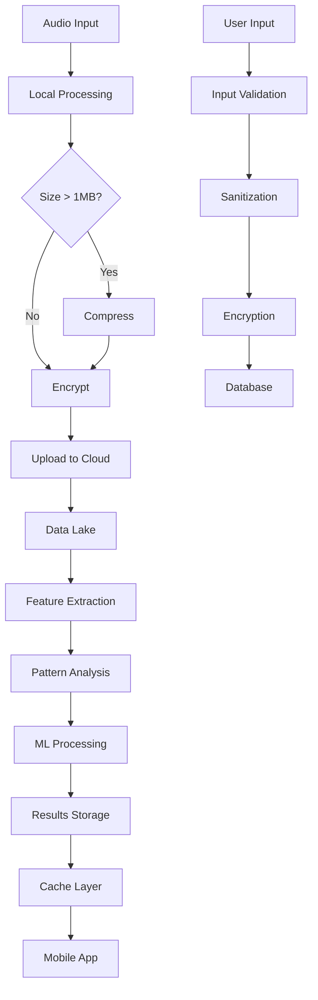
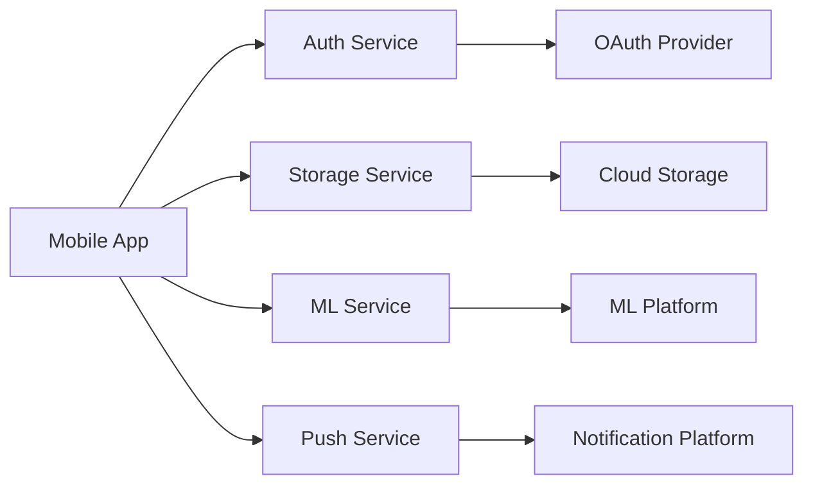

# Product Requirements Document (PRD)

# 1. INTRODUCTION

## 1.1 Purpose

This Product Requirements Document (PRD) specifies the functional and non-functional requirements for the Baby Cry Analyzer mobile application. The document serves as a comprehensive guide for:

- Development teams implementing the solution
- Quality assurance teams validating the product
- Product managers overseeing development
- Stakeholders evaluating project progress
- UX/UI designers creating the user interface
- Technical architects designing the system architecture

## 1.2 Scope

The Baby Cry Analyzer is a mobile application that uses advanced audio processing and machine learning to analyze infant crying patterns and help parents understand their babies' needs. The system encompasses:

- Real-time cry analysis and need identification
- Historical pattern tracking and visualization
- Personalized baby care recommendations
- Community support and expert guidance integration

Key Features:
- Audio capture and processing engine for cry analysis
- Pattern recognition algorithms for need classification
- User-friendly mobile interface with monitoring dashboard
- Data analytics for pattern learning and predictions
- Secure baby profile management system
- Community and expert support network integration
- Comprehensive reporting and tracking tools

Out of Scope:
- Medical diagnosis or treatment recommendations
- Remote baby monitoring or video capabilities
- Direct healthcare provider integration
- Physical device manufacturing or hardware components

# 2. PRODUCT DESCRIPTION

## 2.1 Product Perspective

The Baby Cry Analyzer operates as a standalone mobile application that integrates with the device's microphone and processing capabilities. The system fits into the broader ecosystem of infant care tools and operates within these contexts:

- Primary mobile application running on iOS and Android devices
- Cloud-based backend for data processing and storage
- Integration with existing baby care tracking applications
- Compliance with healthcare data privacy frameworks
- Connection to expert and community support networks

## 2.2 Product Functions

The primary functions of the Baby Cry Analyzer include:

1. Cry Analysis and Classification
   - Real-time audio capture and processing
   - Pattern matching against cry signature database
   - Need classification with confidence scoring
   - Background noise filtering and isolation

2. Pattern Learning and Prediction
   - Historical cry pattern analysis
   - Machine learning-based need prediction
   - Personalized baby routine optimization
   - Environmental factor correlation

3. Data Management and Visualization
   - Secure baby profile storage
   - Historical trend analysis
   - Interactive dashboards and reports
   - Data export capabilities

4. Support Network Integration
   - Expert advice connection
   - Community interaction features
   - Care recommendation engine
   - Emergency contact management

## 2.3 User Characteristics

Primary Users:
- New Parents
  - Limited experience with infant care
  - Varying levels of technical proficiency
  - High stress and sleep-deprived states
  - Need for immediate, actionable insights

Secondary Users:
- Caregivers
  - Professional or family members
  - Variable experience levels
  - Require quick access to baby's history
  - Need clear instructions and guidance

Tertiary Users:
- Healthcare Providers
  - Professional medical background
  - Interest in pattern analysis data
  - Need for objective crying history
  - Focus on trend visualization

## 2.4 Constraints

Technical Constraints:
- Mobile device processing capabilities
- Microphone quality and sensitivity
- Battery life considerations
- Internet connectivity requirements
- Local storage limitations

Regulatory Constraints:
- HIPAA compliance requirements
- GDPR and data privacy regulations
- Medical device classification limits
- Child data protection laws

Business Constraints:
- Time-to-market requirements
- Development budget limitations
- Resource availability
- Third-party integration restrictions

## 2.5 Assumptions and Dependencies

Assumptions:
- Users have compatible mobile devices
- Stable internet connection available
- Access to device microphone granted
- Regular app usage for pattern learning
- User willingness to share data

Dependencies:
- Cloud service providers
- Machine learning model accuracy
- Third-party API availability
- Expert network participation
- Mobile platform updates
- Database service reliability
- Authentication service availability

# 3. PROCESS FLOWCHART







# 4. FUNCTIONAL REQUIREMENTS

## 4.1 Sound Analysis Engine

### ID: F-SAE

### Description
Core system for processing and analyzing baby cry audio in real-time to identify patterns and classify needs.

### Priority
Critical (P0)

### Requirements Table

| ID | Requirement | Priority | Notes |
|---|---|---|---|
| F-SAE-01 | Capture audio input with minimum 44.1kHz sampling rate | P0 | Must support background operation |
| F-SAE-02 | Filter background noise using adaptive noise cancellation | P0 | Minimum 20dB noise reduction |
| F-SAE-03 | Detect and isolate baby cry patterns from other sounds | P0 | 95% accuracy requirement |
| F-SAE-04 | Classify cry into predefined need categories | P0 | Hunger, pain, sleepy, discomfort, etc. |
| F-SAE-05 | Generate confidence score for each classification | P1 | Scale of 0-100% |
| F-SAE-06 | Support multiple baby differentiation | P2 | Up to 3 distinct cry patterns |
| F-SAE-07 | Store processed audio patterns securely | P1 | Local and cloud storage |

## 4.2 User Interface

### ID: F-UI

### Description
Mobile application interface providing real-time monitoring and historical analysis tools.

### Priority
Critical (P0)

### Requirements Table

| ID | Requirement | Priority | Notes |
|---|---|---|---|
| F-UI-01 | Display real-time cry analysis dashboard | P0 | Update within 1 second |
| F-UI-02 | Provide historical pattern visualization | P0 | Daily, weekly, monthly views |
| F-UI-03 | Support baby profile creation and management | P0 | Multiple profiles allowed |
| F-UI-04 | Implement night mode interface | P1 | Automatic switching option |
| F-UI-05 | Display confidence scores visually | P1 | Color-coded indicators |
| F-UI-06 | Enable manual recording library management | P2 | Categorization and tagging |
| F-UI-07 | Show quick-action response suggestions | P0 | Context-based recommendations |

## 4.3 Smart Features

### ID: F-SF

### Description
Advanced analytics and machine learning capabilities for pattern recognition and predictions.

### Priority
High (P1)

### Requirements Table

| ID | Requirement | Priority | Notes |
|---|---|---|---|
| F-SF-01 | Learn and adapt to individual baby patterns | P1 | Minimum 2 weeks learning period |
| F-SF-02 | Generate personalized care recommendations | P1 | Based on historical data |
| F-SF-03 | Predict upcoming needs based on patterns | P1 | 80% accuracy minimum |
| F-SF-04 | Track sleep schedule patterns | P1 | Integration with cry analysis |
| F-SF-05 | Monitor feeding time patterns | P1 | Pattern-based predictions |
| F-SF-06 | Detect unusual cry patterns | P0 | Alert for anomalies |
| F-SF-07 | Analyze environmental impact factors | P2 | Temperature, noise, time |

## 4.4 Parent Support System

### ID: F-PSS

### Description
Community and expert support features integrated with core analysis functionality.

### Priority
High (P1)

### Requirements Table

| ID | Requirement | Priority | Notes |
|---|---|---|---|
| F-PSS-01 | Connect with pediatric experts | P1 | In-app consultation |
| F-PSS-02 | Enable community interaction | P1 | Moderated forums |
| F-PSS-03 | Maintain care tips database | P1 | Regular content updates |
| F-PSS-04 | Manage emergency contacts | P0 | Quick-dial integration |
| F-PSS-05 | Generate shareable progress reports | P2 | PDF export capability |
| F-PSS-06 | Track daily care activities | P1 | Customizable log entries |
| F-PSS-07 | Support data sharing with healthcare providers | P2 | Secure export format |

# 5. NON-FUNCTIONAL REQUIREMENTS

## 5.1 Performance Requirements

| ID | Requirement | Target | Notes |
|---|---|---|---|
| NFR-P-01 | Audio processing latency | < 500ms | From capture to classification |
| NFR-P-02 | App launch time | < 2 seconds | On supported devices |
| NFR-P-03 | Battery consumption | < 5%/hour | During active monitoring |
| NFR-P-04 | Storage usage | < 100MB local | Excluding recorded clips |
| NFR-P-05 | Network bandwidth | < 50MB/day | Normal usage patterns |
| NFR-P-06 | Concurrent users | 100,000+ | Per region |
| NFR-P-07 | Database response time | < 100ms | For data retrieval |

## 5.2 Safety Requirements

| ID | Requirement | Description |
|---|---|---|
| NFR-S-01 | Failsafe operation | Graceful degradation to basic monitoring if advanced features fail |
| NFR-S-02 | Data backup | Automated daily backups with 30-day retention |
| NFR-S-03 | Error handling | Clear user notifications for system issues |
| NFR-S-04 | Recovery time | < 5 minutes system recovery after failure |
| NFR-S-05 | Offline operation | Core functions available without internet |
| NFR-S-06 | Data integrity | Checksums for all stored audio patterns |
| NFR-S-07 | Emergency mode | Priority operation during critical situations |

## 5.3 Security Requirements

| ID | Requirement | Description |
|---|---|---|
| NFR-SE-01 | Authentication | Multi-factor authentication support |
| NFR-SE-02 | Data encryption | AES-256 for stored data, TLS 1.3 for transmission |
| NFR-SE-03 | Access control | Role-based access with granular permissions |
| NFR-SE-04 | Audit logging | Complete activity trail with timestamp |
| NFR-SE-05 | Session management | Automatic timeout after 30 minutes inactivity |
| NFR-SE-06 | Privacy controls | Opt-in data sharing and collection |
| NFR-SE-07 | Secure storage | Encrypted local storage for sensitive data |

## 5.4 Quality Requirements

### 5.4.1 Availability
- System uptime: 99.9%
- Scheduled maintenance: < 4 hours/month
- Unplanned downtime: < 1 hour/month

### 5.4.2 Maintainability
- Code documentation: 100% coverage
- Modular architecture with clear interfaces
- Automated testing coverage: > 85%
- Regular dependency updates

### 5.4.3 Usability
- First-time user success rate: > 90%
- Task completion time: < 30 seconds
- Error rate: < 1%
- Help documentation: Context-sensitive
- Accessibility: WCAG 2.1 AA compliance

### 5.4.4 Scalability
- Linear performance up to 1M users
- Auto-scaling cloud infrastructure
- Horizontal scaling capability
- Load balancing across regions

### 5.4.5 Reliability
- Mean Time Between Failures: > 720 hours
- Mean Time To Recovery: < 10 minutes
- Error rate: < 0.1%
- Data durability: 99.999%

## 5.5 Compliance Requirements

| ID | Requirement | Description |
|---|---|---|
| NFR-C-01 | HIPAA | Compliance with healthcare data privacy |
| NFR-C-02 | GDPR | EU data protection requirements |
| NFR-C-03 | COPPA | Children's privacy protection |
| NFR-C-04 | ISO 27001 | Information security standards |
| NFR-C-05 | WCAG 2.1 | Accessibility guidelines |
| NFR-C-06 | FDA | Non-medical device classification |
| NFR-C-07 | Local Laws | Regional data protection compliance |

# 6. DATA REQUIREMENTS

## 6.1 Data Models

```mermaid
erDiagram
    Baby ||--o{ CryRecord : has
    Baby ||--o{ Profile : has
    Baby ||--o{ GrowthRecord : tracks
    CryRecord ||--o{ Analysis : generates
    Analysis ||--o{ Recommendation : creates
    Parent ||--o{ Baby : manages
    Parent ||--o{ FeedbackRecord : provides
    Expert ||--o{ Recommendation : provides
    Community ||--o{ Discussion : contains
    
    Baby {
        uuid id
        string name
        date birthDate
        string gender
        float weight
        float height
        datetime createdAt
    }
    
    CryRecord {
        uuid id
        uuid babyId
        blob audioData
        datetime timestamp
        json metadata
        string environment
    }
    
    Analysis {
        uuid id
        uuid cryRecordId
        string needType
        float confidenceScore
        json patternData
        datetime analyzedAt
    }
    
    Profile {
        uuid id
        uuid babyId
        json preferences
        json routines
        datetime lastUpdated
    }
    
    Parent {
        uuid id
        string email
        string name
        datetime joinDate
        json settings
    }
}
```

## 6.2 Data Storage

### 6.2.1 Storage Requirements

| Data Type | Storage Location | Retention Period | Backup Frequency |
|-----------|-----------------|------------------|------------------|
| Audio Recordings | Cloud Object Storage | 90 days | Daily |
| Analysis Results | NoSQL Database | 1 year | Real-time |
| User Profiles | Relational Database | Account lifetime | Hourly |
| Pattern Data | Time-series Database | 2 years | Daily |
| App Settings | Local Storage | Session based | On change |
| Cached Data | Local Storage | 7 days | None |

### 6.2.2 Redundancy and Backup

- Primary data center with hot standby replication
- Geographic redundancy across three regions
- Daily incremental backups with weekly full backups
- 30-day backup retention policy
- Point-in-time recovery capability within 7 days
- 99.999% durability guarantee for all stored data

## 6.3 Data Processing



### 6.3.1 Data Security

| Security Layer | Implementation |
|----------------|----------------|
| Encryption at Rest | AES-256 encryption |
| Encryption in Transit | TLS 1.3 |
| Access Control | Role-based with JWT |
| Data Masking | PII encryption |
| Audit Logging | All data access tracked |
| Key Management | AWS KMS integration |

### 6.3.2 Data Processing Requirements

| Process Type | Max Latency | Batch Size | Priority |
|-------------|-------------|------------|-----------|
| Audio Analysis | 500ms | 1 record | High |
| Pattern Recognition | 1000ms | 1 record | High |
| Batch Analytics | 1 hour | 1000 records | Low |
| Report Generation | 5 seconds | 100 records | Medium |
| ML Training | 24 hours | All records | Low |

### 6.3.3 Data Validation Rules

- Audio files: WAV or MP3 format, max 30 seconds
- Profile data: Required fields validation
- Measurements: Range checking for age-appropriate values
- Timestamps: UTC standardization
- Text input: XSS and injection prevention
- File sizes: Compression for >1MB files
- Data integrity: Checksum verification

# 7. EXTERNAL INTERFACES

## 7.1 User Interfaces

### 7.1.1 Mobile Application Interface Requirements

| Screen | Core Requirements | Interaction Methods |
|--------|------------------|-------------------|
| Dashboard | Real-time cry monitoring, Quick actions, Status indicators | Touch, Swipe, Voice commands |
| Analysis View | Waveform visualization, Need classification display, Confidence meters | Touch, Pinch-zoom, Rotate |
| History | Timeline view, Pattern graphs, Filtering options | Scroll, Touch, Date selection |
| Settings | Profile management, Notification controls, Audio settings | Toggle, Select, Input |
| Community | Forum view, Expert chat, Resource library | Scroll, Touch, Text input |

### 7.1.2 Interface Guidelines

- Material Design 3.0 for Android
- iOS Human Interface Guidelines compliance
- Minimum touch target size: 44x44 points
- Maximum 3 clicks to any function
- Consistent color scheme across platforms
- Support for system-level dark mode
- Dynamic text sizing support

## 7.2 Hardware Interfaces

### 7.2.1 Microphone Requirements

| Requirement | Specification |
|-------------|--------------|
| Sampling Rate | 44.1kHz minimum |
| Bit Depth | 16-bit minimum |
| Frequency Response | 20Hz - 20kHz |
| Signal-to-Noise Ratio | >60dB |
| Latency | <10ms |

### 7.2.2 Device Requirements

| Component | Minimum Specification |
|-----------|---------------------|
| Processor | 1.8GHz Quad-core |
| RAM | 2GB |
| Storage | 500MB free space |
| Battery Impact | <5% per hour monitoring |
| Sensors | Microphone, Light sensor |

## 7.3 Software Interfaces

### 7.3.1 External Services Integration

| Service | Interface Type | Protocol | Purpose |
|---------|---------------|----------|----------|
| Cloud Storage | REST API | HTTPS | Audio data storage |
| Authentication | OAuth 2.0 | HTTPS | User authentication |
| Analytics | SDK | Native | Usage tracking |
| Push Notifications | FCM/APNS | HTTPS | Alert delivery |
| ML Processing | gRPC | HTTP/2 | Pattern analysis |

### 7.3.2 Third-Party Integration Requirements



## 7.4 Communication Interfaces

### 7.4.1 Network Requirements

| Type | Specification |
|------|--------------|
| Protocol | HTTPS/WSS |
| Security | TLS 1.3 |
| Bandwidth | 50MB/day average |
| Latency | <100ms RTT |
| Timeout | 30 seconds |
| Retry Logic | Exponential backoff |

### 7.4.2 API Specifications

| Endpoint Type | Format | Compression |
|--------------|--------|-------------|
| REST APIs | JSON | GZIP |
| WebSocket | Binary | None |
| File Transfer | Multipart | GZIP |
| Streaming | Protocol Buffers | None |

### 7.4.3 Data Exchange Formats

```json
{
  "audioAnalysis": {
    "timestamp": "ISO-8601",
    "format": "wav",
    "sampleRate": 44100,
    "duration": "float",
    "features": {
      "frequency": "array",
      "amplitude": "array",
      "patterns": "object"
    },
    "results": {
      "classification": "string",
      "confidence": "float",
      "recommendations": "array"
    }
  }
}
```

# 8. APPENDICES

## 8.1 GLOSSARY

| Term | Definition |
|------|------------|
| Cry Pattern | A distinct combination of acoustic features in a baby's cry that indicates a specific need |
| Confidence Score | Numerical value (0-100%) indicating the system's certainty in cry classification |
| Pattern Learning | Process of analyzing historical cry data to improve classification accuracy |
| Need Classification | Categorization of cry patterns into specific needs (hunger, pain, sleep, etc.) |
| Adaptive Noise Cancellation | Technology to remove background noise from cry audio in real-time |
| Quick Response | Immediate care suggestions based on cry analysis results |
| Growth Milestone | Key developmental achievements tracked within the application |
| Care Routine | Established pattern of feeding, sleeping, and care activities |

## 8.2 ACRONYMS

| Acronym | Expansion |
|---------|-----------|
| AES | Advanced Encryption Standard |
| APNS | Apple Push Notification Service |
| COPPA | Children's Online Privacy Protection Act |
| FCM | Firebase Cloud Messaging |
| GDPR | General Data Protection Regulation |
| HIPAA | Health Insurance Portability and Accountability Act |
| JWT | JSON Web Token |
| KMS | Key Management Service |
| ML | Machine Learning |
| PII | Personally Identifiable Information |
| RTT | Round Trip Time |
| TLS | Transport Layer Security |
| UTC | Coordinated Universal Time |
| WCAG | Web Content Accessibility Guidelines |
| WSS | WebSocket Secure |
| XSS | Cross-Site Scripting |

## 8.3 ADDITIONAL REFERENCES

| Category | Reference |
|----------|-----------|
| Audio Processing | "Digital Signal Processing: Principles, Algorithms and Applications" - Proakis & Manolakis |
| Machine Learning | "Pattern Recognition and Machine Learning" - Christopher Bishop |
| Mobile Development | Material Design Guidelines (material.io) |
| Mobile Development | iOS Human Interface Guidelines (developer.apple.com) |
| Security | OWASP Mobile Security Testing Guide |
| Healthcare | HL7 FHIR Standards for Healthcare Data Exchange |
| Accessibility | WCAG 2.1 Guidelines (w3.org) |
| Data Protection | GDPR Compliance Checklist (gdpr.eu) |

## 8.4 TECHNICAL DEPENDENCIES

| Component | Technology Stack |
|-----------|-----------------|
| Frontend Mobile | React Native 0.71+ |
| Backend Services | Node.js 18+, Express 4.x |
| Database | MongoDB 6.0+, Redis 7.0+ |
| ML Framework | TensorFlow 2.x |
| Cloud Infrastructure | AWS (EC2, S3, Lambda) |
| Authentication | Auth0 |
| Analytics | Firebase Analytics |
| CI/CD | GitHub Actions |
| Monitoring | New Relic |
| Testing | Jest, Detox |