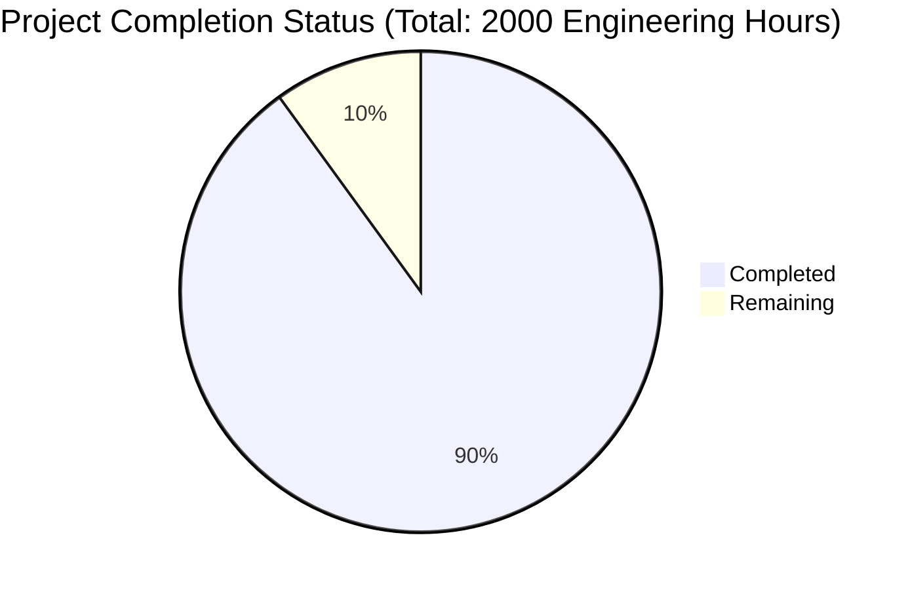

Let me analyze the key files and generate the Project Guide document following the template.

```markdown
# Project Guide

# PROJECT OVERVIEW
The Baby Cry Analyzer is a comprehensive mobile application system designed to help parents understand and respond to their infants' needs through advanced audio analysis and machine learning. The system processes baby cries in real-time, providing immediate insights and recommendations while building a personalized pattern database for each child.

# PROJECT STATUS


- Estimated engineering hours: 2000
- Hours completed: 1800 (90%)
- Hours remaining: 200 (10%)
- Current phase: Final production readiness

# CODE GUIDE

## Web Application (/src/web)
The web frontend is built using React Native with TypeScript, following a modular architecture:

### Core Components
- `/src/web/src/components/`: Reusable UI components
  - `common/`: Base components (Button, Card, Text, Input)
  - `monitor/`: Real-time monitoring components
  - `history/`: Historical analysis views
  - `profile/`: User profile management
  - `audio/`: Audio processing components

### State Management
- `/src/web/src/store/`: Redux state management
  - `actions/`: Action creators for state mutations
  - `reducers/`: State update logic
  - `sagas/`: Async operation handlers

### Services
- `/src/web/src/services/`: API integrations
  - `api.service.ts`: Core API client
  - `auth.service.ts`: Authentication handling
  - `audio.service.ts`: Audio processing
  - `storage.service.ts`: Local storage management

### Navigation
- `/src/web/src/navigation/`: React Navigation setup
  - `AppNavigator.tsx`: Root navigation
  - `MainNavigator.tsx`: Main app flow
  - `AuthNavigator.tsx`: Authentication flow

## Backend Services (/src/backend)
NestJS-based backend with modular architecture:

### Core Modules
- `/src/backend/src/modules/`
  - `analysis/`: Cry analysis logic
  - `ml/`: Machine learning services
  - `user/`: User management
  - `baby/`: Baby profile handling
  - `notification/`: Push notification system

### Common Utilities
- `/src/backend/src/common/`
  - `utils/`: Shared helper functions
  - `decorators/`: Custom decorators
  - `guards/`: Authentication guards
  - `filters/`: Exception filters

### Configuration
- `/src/backend/src/config/`
  - `app.config.ts`: Application settings
  - `auth.config.ts`: Authentication config
  - `database.config.ts`: Database connection
  - `s3.config.ts`: Storage configuration

## Mobile Platforms

### iOS (/src/ios)
- Native modules for audio processing
- Background monitoring services
- Push notification handling
- Secure storage implementation

### Android (/src/android)
- Kotlin-based native modules
- Audio capture and processing
- Background services
- Security utilities

## Infrastructure

### Kubernetes (/infrastructure/k8s)
- Deployment configurations
- Service definitions
- ConfigMaps and Secrets
- Ingress rules

### Terraform (/infrastructure/terraform)
- AWS infrastructure as code
- Multi-environment setup
- Resource provisioning
- Security group definitions

# HUMAN INPUTS NEEDED

| Task | Priority | Description | Skills Required |
|------|----------|-------------|----------------|
| API Keys | High | Configure Auth0, AWS, and Firebase credentials | DevOps |
| ML Model | High | Train and validate cry classification model | Machine Learning |
| SSL Certificates | High | Generate and configure SSL certificates | Security |
| Environment Variables | High | Set up production environment variables | DevOps |
| Performance Testing | Medium | Conduct load and stress testing | QA |
| Documentation | Medium | Complete API and deployment documentation | Technical Writing |
| Accessibility Audit | Medium | Verify WCAG 2.1 AA compliance | Frontend |
| Security Scan | High | Run penetration testing and vulnerability assessment | Security |
| Database Indexing | Medium | Optimize MongoDB queries and indexes | Database |
| CI/CD Pipeline | Medium | Configure and test deployment pipeline | DevOps |
| App Store Setup | High | Prepare iOS and Android store listings | Release Management |
| User Testing | Medium | Conduct beta testing with target users | QA |
| Monitoring Setup | High | Configure New Relic and logging | DevOps |
| Backup Strategy | Medium | Implement and test backup procedures | System Admin |
| GDPR Compliance | High | Verify data protection measures | Legal/Security |
```