# Technical Specifications

# 1. INTRODUCTION

## 1.1 EXECUTIVE SUMMARY

The Baby Cry Analyzer is an innovative mobile application designed to help parents understand and respond to their infants' needs through advanced audio analysis and machine learning. By analyzing crying patterns in real-time, the system provides immediate insights into babies' needs, reducing parental stress and improving response times. The solution serves new parents and caregivers who struggle with interpreting their babies' cries, offering data-driven guidance and building a supportive community for infant care.

The system addresses the critical challenge of infant need interpretation through a combination of real-time audio processing, pattern recognition, and personalized learning algorithms, delivering actionable insights to parents when they need them most.

## 1.2 SYSTEM OVERVIEW

### Project Context

| Aspect | Description |
|--------|-------------|
| Market Position | First-to-market AI-powered cry analysis solution with community integration |
| Target Users | New parents, caregivers, and healthcare providers |
| Market Gap | Lack of objective, data-driven infant need interpretation tools |
| Integration Landscape | Standalone solution with optional integration capabilities for healthcare systems |

### High-Level Description

The system architecture comprises four primary components:

1. Sound Analysis Engine
   - Real-time audio processing
   - Pattern recognition algorithms
   - Need classification system
   - Background noise filtering

2. Mobile Application Interface
   - Live monitoring dashboard
   - Historical pattern analysis
   - Profile management
   - Community integration

3. Machine Learning Platform
   - Pattern learning algorithms
   - Personalized recommendations
   - Predictive analytics
   - Continuous improvement system

4. Support Network Infrastructure
   - Expert connection platform
   - Community engagement system
   - Knowledge base management
   - Emergency response integration

### Success Criteria

| Metric | Target |
|--------|--------|
| Cry Classification Accuracy | >90% |
| Response Time Improvement | >50% |
| Parent Stress Reduction | >40% |
| User Satisfaction | >85% |
| Pattern Learning Speed | <2 weeks |
| Active Daily Users | >100,000 |

## 1.3 SCOPE

### In-Scope Elements

Core Features:
- Real-time cry analysis and classification
- Historical pattern tracking and visualization
- Personalized baby care recommendations
- Community and expert support integration
- Secure data management and privacy controls
- Mobile application for iOS and Android
- Cloud-based processing and storage
- Machine learning model training and adaptation

Implementation Boundaries:
- Mobile platforms: iOS 14+ and Android 10+
- Geographic coverage: North America, Europe, Asia Pacific
- Languages: English, Spanish, Mandarin
- Data retention: 24 months rolling
- User capacity: 1M concurrent users

### Out-of-Scope Elements

- Medical diagnosis or treatment recommendations
- Video monitoring capabilities
- Hardware device manufacturing
- Direct healthcare provider system integration
- Prescription management
- Insurance claim processing
- Remote monitoring between devices
- Real-time translation services
- Custom hardware accessories
- Offline pattern learning

# 2. SYSTEM ARCHITECTURE

## 2.1 High-Level Architecture

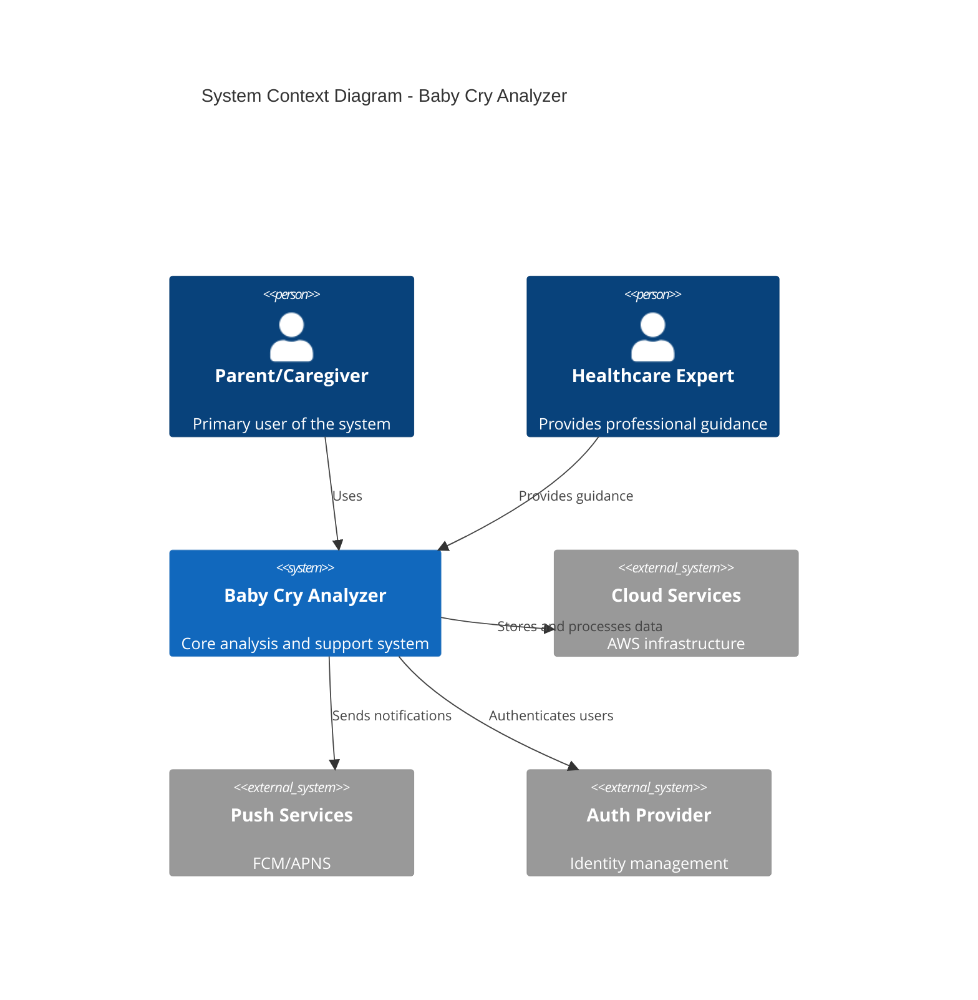

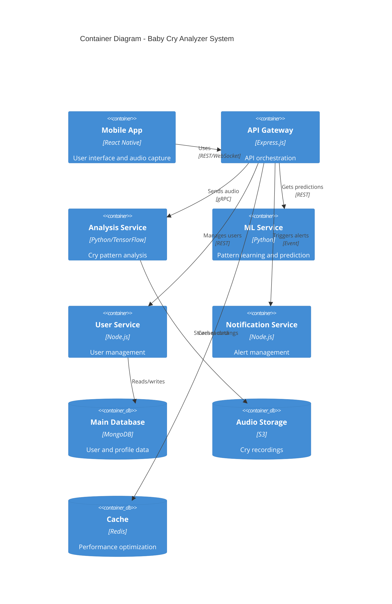

## 2.2 Component Details

### 2.2.1 Mobile Application Component

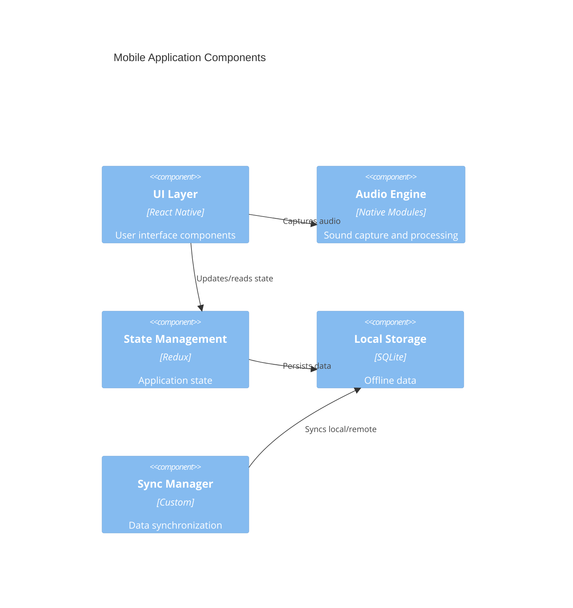

### 2.2.2 Backend Services Component

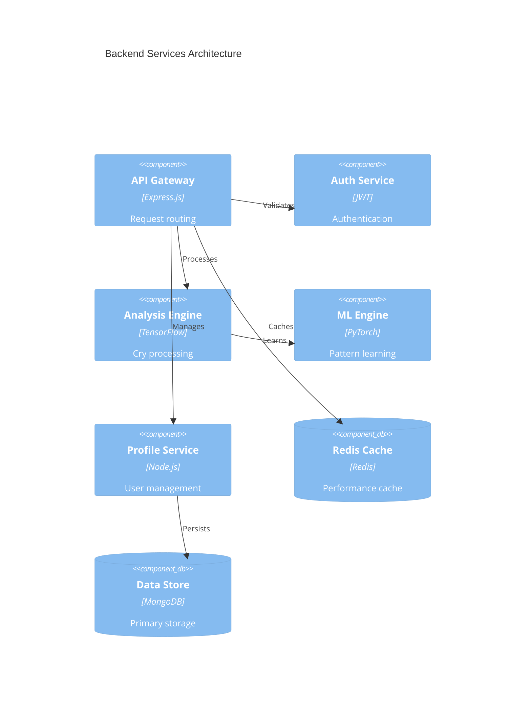

## 2.3 Technical Decisions

### 2.3.1 Architecture Pattern Selection

| Pattern | Selection | Justification |
|---------|-----------|---------------|
| Overall Style | Microservices | Scalability, independent deployment |
| Communication | Event-driven | Real-time processing requirements |
| Data Storage | Polyglot Persistence | Optimized for different data types |
| Caching | Multi-level | Performance optimization |
| API Design | REST + WebSocket | Real-time + standard operations |

### 2.3.2 Technology Stack

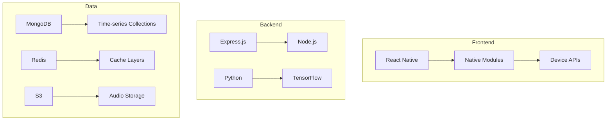

## 2.4 Cross-Cutting Concerns

### 2.4.1 System Monitoring

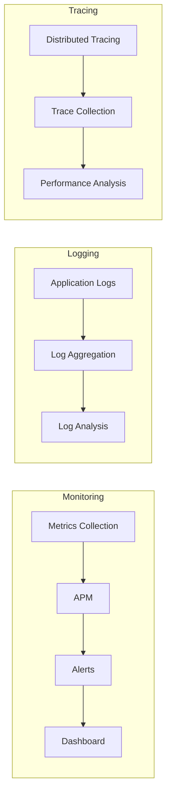

### 2.4.2 Security Architecture

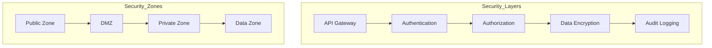

## 2.5 Deployment Architecture

```mermaid
C4Deployment
    title Deployment Architecture

    Deployment_Node(client, "Client Device", "Mobile Phone"){
        Container(app, "Mobile App", "React Native")
    }
    
    Deployment_Node(cloud, "AWS Cloud"){
        Deployment_Node(web, "Web Tier"){
            Container(api, "API Gateway", "ECS")
        }
        
        Deployment_Node(app, "Application Tier"){
            Container(services, "Microservices", "ECS")
        }
        
        Deployment_Node(data, "Data Tier"){
            ContainerDb(db, "Databases", "MongoDB/Redis")
            ContainerDb(storage, "Object Storage", "S3")
        }
    }
    
    Rel(client, cloud, "Uses", "HTTPS/WSS")
```

# 3. SYSTEM COMPONENTS ARCHITECTURE

## 3.1 USER INTERFACE DESIGN

### 3.1.1 Design Specifications

| Aspect | Requirement | Details |
|--------|-------------|---------|
| Visual Hierarchy | Material Design 3.0 | Focus on critical monitoring elements |
| Component Library | Custom React Native UI Kit | Standardized components for consistency |
| Responsive Design | Adaptive layouts | Support for phones and tablets |
| Accessibility | WCAG 2.1 AA | Full screen reader support |
| Device Support | iOS 14+, Android 10+ | Optimized for latest 2 versions |
| Theme Support | Dynamic theming | System-level dark mode integration |
| Localization | RTL support | Initial: EN, ES, CN languages |

### 3.1.2 Interface Elements

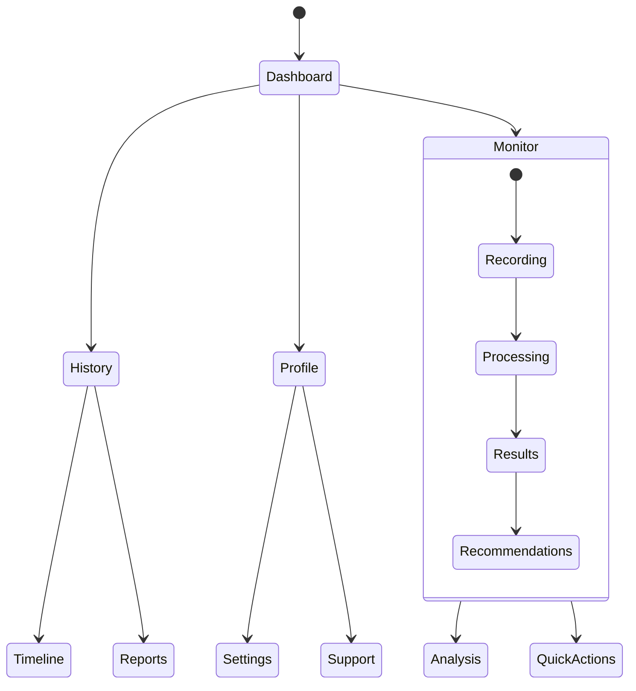

### 3.1.3 Critical User Flows

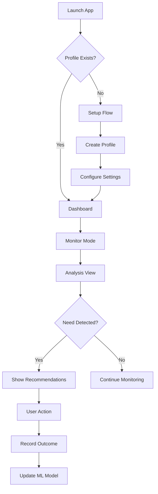

## 3.2 DATABASE DESIGN

### 3.2.1 Schema Design

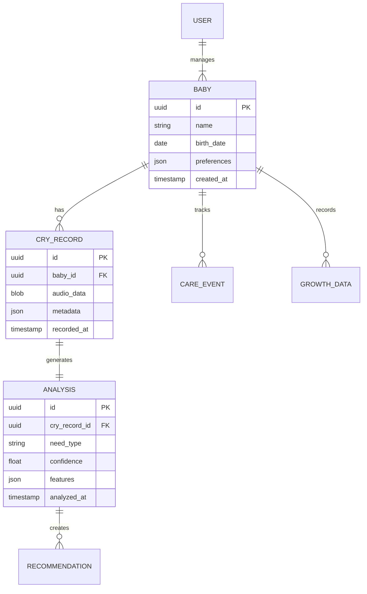

### 3.2.2 Data Management Strategy

| Aspect | Strategy | Implementation |
|--------|----------|----------------|
| Partitioning | Time-based | Monthly partitions for cry data |
| Indexing | Composite | Optimized for common queries |
| Archival | Cold storage | Move to S3 after 90 days |
| Retention | Tiered | Active: 90d, Archive: 2y |
| Backup | Continuous | Point-in-time recovery |
| Encryption | AES-256 | All PII and audio data |

### 3.2.3 Performance Optimization

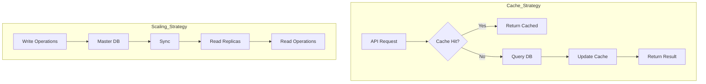

## 3.3 API DESIGN

### 3.3.1 API Architecture

| Component | Specification | Details |
|-----------|--------------|---------|
| Protocol | REST + WebSocket | HTTPS/WSS |
| Auth | JWT + OAuth2 | Refresh token rotation |
| Rate Limits | Tiered | 100/min per user |
| Versioning | URI-based | /v1/, /v2/, etc. |
| Documentation | OpenAPI 3.0 | Auto-generated docs |
| Security | OWASP Top 10 | Regular security audits |

### 3.3.2 API Endpoints

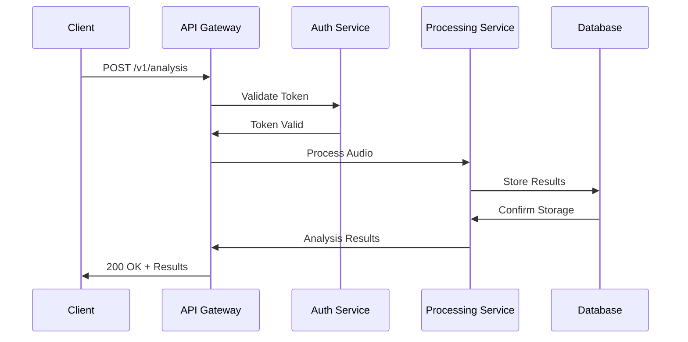

### 3.3.3 Integration Specifications

| Integration Type | Protocol | Security |
|-----------------|----------|-----------|
| ML Service | gRPC | mTLS |
| Storage Service | REST | IAM + HMAC |
| Push Notifications | REST | API Key + JWT |
| Analytics | REST | API Key |
| Expert Network | GraphQL | OAuth2 |

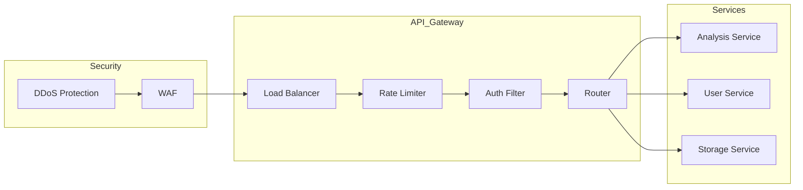

# 4. TECHNOLOGY STACK

## 4.1 PROGRAMMING LANGUAGES

| Platform/Component | Language | Version | Justification |
|-------------------|----------|---------|---------------|
| Mobile Frontend | TypeScript | 4.9+ | Type safety, IDE support, React Native compatibility |
| Backend Services | Node.js | 18 LTS | Event-driven architecture, audio processing libraries |
| ML Services | Python | 3.9+ | Rich ML/AI ecosystem, TensorFlow support |
| Native Modules | Swift/Kotlin | Swift 5.7, Kotlin 1.8 | Native audio capture performance |
| Build Tools | Go | 1.19+ | Efficient build pipeline processing |

## 4.2 FRAMEWORKS & LIBRARIES

### Core Frameworks

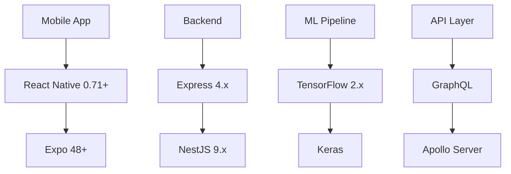

### Supporting Libraries

| Category | Library | Version | Purpose |
|----------|---------|---------|----------|
| State Management | Redux Toolkit | 1.9+ | Centralized state management |
| Audio Processing | TensorFlowJS | 4.2+ | Client-side audio analysis |
| Data Validation | Joi | 17+ | Schema validation |
| Testing | Jest/Detox | 29+/20+ | Unit/E2E testing |
| Documentation | OpenAPI | 3.0 | API documentation |

## 4.3 DATABASES & STORAGE

### Data Architecture

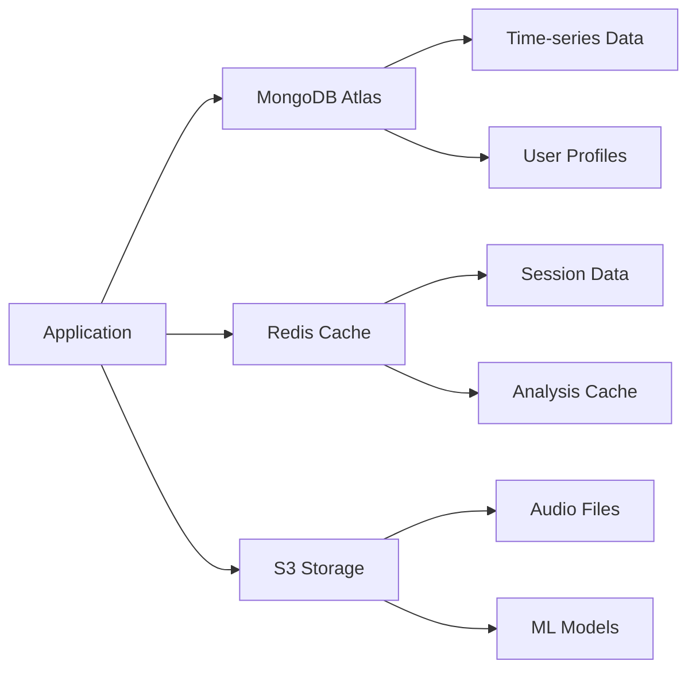

### Storage Solutions

| Type | Technology | Purpose | Retention |
|------|------------|---------|-----------|
| Primary DB | MongoDB 6.0+ | User/Analysis data | Active |
| Cache | Redis 7.0+ | Performance optimization | Temporary |
| Object Storage | AWS S3 | Audio files/ML models | Long-term |
| Time-series | MongoDB Time-series | Pattern analysis | 90 days |

## 4.4 THIRD-PARTY SERVICES

### Service Integration

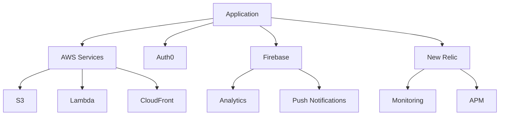

### Service Matrix

| Service | Provider | Purpose | SLA |
|---------|----------|---------|-----|
| Authentication | Auth0 | User management | 99.9% |
| Cloud Infrastructure | AWS | Core services | 99.99% |
| Push Notifications | Firebase | User alerts | 99.95% |
| Monitoring | New Relic | Performance tracking | 99.9% |
| CDN | CloudFront | Content delivery | 99.9% |

## 4.5 DEVELOPMENT & DEPLOYMENT

### Development Pipeline

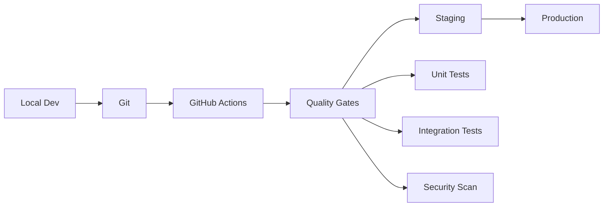

### Infrastructure

| Component | Technology | Purpose |
|-----------|------------|----------|
| Containers | Docker 20.10+ | Service isolation |
| Orchestration | ECS | Container management |
| IaC | Terraform 1.4+ | Infrastructure provisioning |
| CI/CD | GitHub Actions | Automated deployment |
| Monitoring | New Relic | Performance monitoring |

### Development Tools

| Category | Tool | Version | Purpose |
|----------|------|---------|----------|
| IDE | VS Code | Latest | Development environment |
| API Testing | Postman | Latest | API development |
| Profiling | Chrome DevTools | Latest | Performance optimization |
| Documentation | Swagger | 3.0 | API documentation |
| Code Quality | ESLint/Prettier | 8+/2+ | Code standardization |

# 5. SYSTEM DESIGN

## 5.1 USER INTERFACE DESIGN

### 5.1.1 Core Interface Components

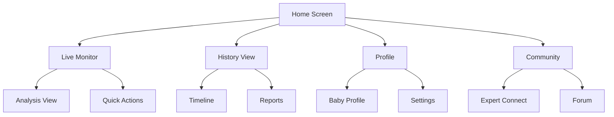

### 5.1.2 Screen Layouts

| Screen | Primary Components | Navigation | Actions |
|--------|-------------------|------------|---------|
| Live Monitor | Audio waveform, Status indicator, Need classification | Bottom tab | Start/Stop, Record, Share |
| Analysis View | Pattern visualization, Confidence meters, Recommendations | Modal | Accept, Reject, Log |
| History | Timeline chart, Pattern grid, Filters | Bottom tab | Filter, Export, Share |
| Profile | Baby info, Growth chart, Milestones | Bottom tab | Edit, Update, Sync |
| Settings | Preferences, Notifications, Audio settings | Stack | Save, Reset, Test |

### 5.1.3 Interaction Patterns

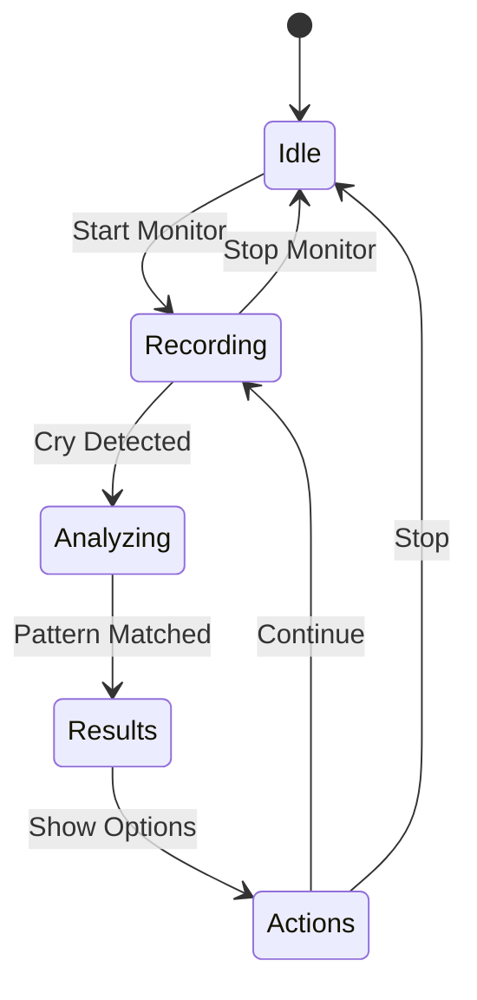

## 5.2 DATABASE DESIGN

### 5.2.1 Data Models

```mermaid
erDiagram
    USER ||--o{ BABY : manages
    BABY ||--o{ CRY_RECORD : generates
    CRY_RECORD ||--|| ANALYSIS : has
    ANALYSIS ||--o{ RECOMMENDATION : produces
    BABY ||--o{ MILESTONE : achieves
    
    USER {
        uuid id PK
        string email
        string name
        timestamp created_at
    }
    
    BABY {
        uuid id PK
        uuid user_id FK
        string name
        date birth_date
        json preferences
    }
    
    CRY_RECORD {
        uuid id PK
        uuid baby_id FK
        blob audio_data
        timestamp recorded_at
        json metadata
    }
    
    ANALYSIS {
        uuid id PK
        uuid cry_record_id FK
        string need_type
        float confidence
        json features
    }
```

### 5.2.2 Storage Strategy

| Data Type | Storage Solution | Retention | Backup |
|-----------|-----------------|-----------|---------|
| User Profiles | MongoDB | Permanent | Daily |
| Audio Records | S3 | 90 days | Weekly |
| Analysis Data | MongoDB | 1 year | Daily |
| ML Models | S3 | Latest 3 versions | On update |
| Cache Data | Redis | 24 hours | None |

## 5.3 API DESIGN

### 5.3.1 REST Endpoints

| Endpoint | Method | Purpose | Auth |
|----------|---------|---------|------|
| /api/v1/analysis | POST | Submit audio for analysis | Required |
| /api/v1/babies/:id/history | GET | Retrieve cry history | Required |
| /api/v1/recommendations | GET | Get care suggestions | Required |
| /api/v1/profiles | PUT | Update baby profile | Required |

### 5.3.2 WebSocket Events

```mermaid
sequenceDiagram
    participant Client
    participant Server
    participant ML
    
    Client->>Server: connect(auth_token)
    Server->>Client: connected
    
    Client->>Server: start_monitoring
    Server->>Client: monitoring_started
    
    loop Audio Stream
        Client->>Server: audio_data
        Server->>ML: process_audio
        ML->>Server: analysis_result
        Server->>Client: cry_detected
    end
    
    Client->>Server: stop_monitoring
    Server->>Client: monitoring_stopped
```

### 5.3.3 Integration Patterns

| Pattern | Implementation | Use Case |
|---------|---------------|-----------|
| Request-Response | REST API | CRUD operations |
| Event Streaming | WebSocket | Real-time monitoring |
| Message Queue | Redis | Async processing |
| Pub/Sub | Redis | Notifications |
| Batch Processing | AWS Batch | ML training |

## 5.4 PROCESSING PIPELINE

```mermaid
flowchart LR
    subgraph Input
        A[Audio Capture] --> B[Noise Filtering]
        B --> C[Feature Extraction]
    end
    
    subgraph Analysis
        C --> D[Pattern Matching]
        D --> E[Need Classification]
        E --> F[Confidence Scoring]
    end
    
    subgraph Output
        F --> G[Result Generation]
        G --> H[Notification]
        G --> I[Storage]
    end
```

## 5.5 DEPLOYMENT ARCHITECTURE

```mermaid
flowchart TB
    subgraph Client
        A[Mobile App]
    end
    
    subgraph Cloud
        subgraph Frontend
            B[API Gateway]
            C[Load Balancer]
        end
        
        subgraph Services
            D[Analysis Service]
            E[User Service]
            F[ML Service]
        end
        
        subgraph Storage
            G[(MongoDB)]
            H[(Redis)]
            I[(S3)]
        end
    end
    
    A --> B
    B --> C
    C --> D
    C --> E
    C --> F
    D --> G
    E --> G
    F --> H
    D --> I
```

# 6. USER INTERFACE DESIGN

## 6.1 Interface Components Key

| Symbol | Meaning |
|--------|---------|
| [#] | Dashboard/Menu |
| [@] | Profile |
| [?] | Help |
| [=] | Settings |
| [+] | Add/Create |
| [x] | Close/Delete |
| [<] [>] | Navigation |
| [!] | Alert/Warning |
| [*] | Important |
| [...] | Text Input |
| [ ] | Checkbox |
| ( ) | Radio Button |
| [v] | Dropdown |
| [====] | Progress Bar |

## 6.2 Main Dashboard

```
+------------------------------------------+
|  Baby Cry Analyzer                    [@] |
+------------------------------------------+
| [#] Dashboard  [*] Monitor  [=] Settings |
+------------------------------------------+
|                                          |
|     Current Status: Monitoring Active    |
|     [============================]  90%   |
|                                          |
|     Last Detection: 5 mins ago          |
|     Classification: Hunger               |
|     Confidence: 95%                      |
|                                          |
|     Quick Actions:                       |
|     [Feed] [Change] [Sleep] [Log]       |
|                                          |
|     Recent History:                      |
|     12:30 - Hunger      [!]             |
|     10:15 - Tired       [*]             |
|     08:45 - Discomfort                  |
|                                          |
|     [View Full History >]                |
+------------------------------------------+
```

## 6.3 Live Monitor View

```
+------------------------------------------+
|  Live Monitor                      [x]    |
+------------------------------------------+
|                                          |
|     Audio Waveform                       |
|     ╭─╮  ╭─╮ ╭──╮  ╭─╮                  |
|     ╰─╯╭─╯ ╰─╯  ╰──╯ ╰─                 |
|                                          |
|     Pattern Match:                       |
|     [===============]  60%               |
|                                          |
|     Current Analysis:                    |
|     Need Type: [Processing...]          |
|     Confidence: [Calculating...]        |
|                                          |
|     Environment:                         |
|     Noise Level: Low                     |
|     Background: Clear                    |
|                                          |
|     [Stop Monitor] [Save Recording]      |
+------------------------------------------+
```

## 6.4 History Analysis

```
+------------------------------------------+
|  Pattern History                    [?]   |
+------------------------------------------+
|  Filter: [...................] [Apply]    |
|  Date Range: [v] Last 7 Days            |
+------------------------------------------+
|                                          |
|  Pattern Distribution:                   |
|  Hunger     [===========]  45%          |
|  Tired      [=======]      28%          |
|  Pain       [===]          12%          |
|  Discomfort [====]         15%          |
|                                          |
|  Timeline:                              |
|  +-- Today                              |
|      +-- 14:30 Hunger     [View]        |
|      +-- 12:15 Tired      [View]        |
|  +-- Yesterday                          |
|      +-- 23:45 Pain       [View]        |
|      +-- 19:30 Hunger     [View]        |
|                                          |
|  [Export Data] [Generate Report]         |
+------------------------------------------+
```

## 6.5 Baby Profile Settings

```
+------------------------------------------+
|  Profile Settings                [@]      |
+------------------------------------------+
|                                          |
|  Baby Information:                       |
|  Name:     [......................]      |
|  Age:      [...] months                  |
|  Weight:   [...] kg                      |
|                                          |
|  Monitoring Preferences:                 |
|  [ ] Enable background monitoring        |
|  [ ] Night mode (reduced brightness)     |
|  [ ] Push notifications                  |
|                                          |
|  Sound Settings:                         |
|  Sensitivity: [v] High                   |
|  Noise Filter: [v] Enabled               |
|                                          |
|  Data Management:                        |
|  Storage Used: [========] 80%            |
|  [Clear History] [Backup Data]           |
|                                          |
|  [Save Changes] [Cancel]                 |
+------------------------------------------+
```

## 6.6 Alert Notifications

```
+------------------------------------------+
|  [!] Alert                         [x]    |
+------------------------------------------+
|                                          |
|     Pattern Detected                     |
|     Time: 14:30                         |
|     Type: Hunger                        |
|     Confidence: 95%                      |
|                                          |
|     Recommended Actions:                 |
|     [*] Feed baby                       |
|     [*] Check diaper                    |
|     [ ] Log response                    |
|                                          |
|     [Take Action] [Dismiss]             |
|                                          |
+------------------------------------------+
```

## 6.7 Navigation Flow

```mermaid
flowchart TD
    A[Dashboard] --> B[Live Monitor]
    A --> C[History Analysis]
    A --> D[Profile Settings]
    
    B --> E[Alert View]
    B --> F[Recording View]
    
    C --> G[Detailed Analysis]
    C --> H[Report Generation]
    
    D --> I[Data Management]
    D --> J[Preferences]
```

## 6.8 Responsive Design Requirements

| Screen Size | Layout Adjustments |
|-------------|-------------------|
| Phone Portrait | Single column, stacked components |
| Phone Landscape | Two-column layout where appropriate |
| Tablet Portrait | Enhanced data visualization |
| Tablet Landscape | Multi-panel view with side navigation |

## 6.9 Accessibility Requirements

- WCAG 2.1 AA compliance
- VoiceOver/TalkBack support
- Minimum touch target size: 44x44 points
- Color contrast ratio: 4.5:1
- Dynamic text sizing support
- Keyboard navigation support
- Screen reader optimized labels

# 7. SECURITY CONSIDERATIONS

## 7.1 AUTHENTICATION AND AUTHORIZATION

### 7.1.1 Authentication Flow

```mermaid
sequenceDiagram
    participant User
    participant App
    participant Auth0
    participant API
    participant Database

    User->>App: Launch Application
    App->>Auth0: Request Authentication
    Auth0->>User: Present Login UI
    User->>Auth0: Provide Credentials
    Auth0->>App: Return JWT Token
    App->>API: Request with JWT
    API->>API: Validate Token
    API->>Database: Authorized Request
    Database->>API: Return Data
    API->>App: Protected Response
```

### 7.1.2 Authorization Matrix

| Role | Monitor | History | Profile | Settings | Admin | Expert Access |
|------|---------|---------|---------|-----------|-------|--------------|
| Parent | Full | Full | Own | Own | None | Read |
| Caregiver | Full | Read | Read | None | None | None |
| Expert | Read | Read | Read | None | None | Full |
| Admin | Full | Full | Full | Full | Full | Full |

### 7.1.3 Token Management

| Token Type | Lifetime | Refresh | Storage |
|------------|----------|---------|---------|
| Access Token | 1 hour | Yes | Secure Memory |
| Refresh Token | 30 days | No | Secure Storage |
| API Key | 90 days | Manual | Environment |
| Session Token | 24 hours | Yes | HTTP Only Cookie |

## 7.2 DATA SECURITY

### 7.2.1 Encryption Standards

| Data Type | At Rest | In Transit | Key Management |
|-----------|----------|------------|----------------|
| Audio Data | AES-256 | TLS 1.3 | AWS KMS |
| User Profiles | AES-256 | TLS 1.3 | AWS KMS |
| Authentication | SHA-256 | TLS 1.3 | Auth0 |
| Analytics | AES-256 | TLS 1.3 | Firebase |

### 7.2.2 Data Protection Flow

```mermaid
flowchart TD
    A[Data Input] --> B{Sensitive?}
    B -->|Yes| C[Encrypt]
    B -->|No| D[Validate]
    C --> D
    D --> E{Store Type}
    E -->|Local| F[Secure Storage]
    E -->|Cloud| G[Encrypted Transit]
    F --> H[Access Control]
    G --> H
    H --> I[Audit Log]
```

### 7.2.3 PII Protection

| Data Element | Storage Method | Access Control | Retention |
|--------------|----------------|----------------|-----------|
| Email | Hashed | Auth Only | Account Life |
| Password | Bcrypt | None | Account Life |
| Baby Data | Encrypted | Parent Only | 24 Months |
| Audio Files | Encrypted | Parent/Caregiver | 90 Days |
| Location | Anonymized | Aggregated Only | 30 Days |

## 7.3 SECURITY PROTOCOLS

### 7.3.1 Network Security

```mermaid
flowchart LR
    subgraph Security_Layers
        A[WAF] --> B[Load Balancer]
        B --> C[API Gateway]
        C --> D[Application]
        D --> E[Database]
    end

    subgraph Security_Controls
        F[DDoS Protection]
        G[Rate Limiting]
        H[IP Filtering]
        I[SSL Termination]
    end

    F --> A
    G --> B
    H --> C
    I --> B
```

### 7.3.2 Security Monitoring

| Component | Monitoring Type | Alert Threshold | Response Time |
|-----------|----------------|-----------------|---------------|
| Auth Service | Real-time | 3 failed attempts | Immediate |
| API Gateway | Rate limiting | 100 req/min | 1 minute |
| Database | Access logs | Unauthorized query | 5 minutes |
| File Storage | Access patterns | Unusual activity | 15 minutes |

### 7.3.3 Security Compliance

| Standard | Requirement | Implementation |
|----------|-------------|----------------|
| HIPAA | Data Privacy | Encryption + Access Control |
| GDPR | User Rights | Data Export + Deletion |
| COPPA | Child Protection | Parent Consent Flow |
| SOC 2 | Security Controls | Audit Logging + Monitoring |
| ISO 27001 | InfoSec Management | Security Policies + Procedures |

### 7.3.4 Incident Response

```mermaid
stateDiagram-v2
    [*] --> Detection
    Detection --> Analysis
    Analysis --> Containment
    Containment --> Eradication
    Eradication --> Recovery
    Recovery --> Lessons
    Lessons --> [*]

    state Analysis {
        [*] --> Triage
        Triage --> Impact
        Impact --> Source
    }
```

### 7.3.5 Security Updates

| Component | Update Frequency | Validation | Rollback Plan |
|-----------|-----------------|------------|---------------|
| OS Dependencies | Monthly | Automated Tests | Version Control |
| Security Patches | As Available | Security Scan | Blue-Green Deploy |
| SSL Certificates | 90 Days | Certificate Check | Backup Cert |
| Auth Rules | Quarterly | Penetration Test | Policy Backup |

# 8. INFRASTRUCTURE

## 8.1 DEPLOYMENT ENVIRONMENT

```mermaid
flowchart TD
    subgraph Production
        A[AWS Cloud] --> B[Multi-Region]
        B --> C[Primary - US East]
        B --> D[Secondary - US West]
        B --> E[DR - EU Central]
    end
    
    subgraph Staging
        F[AWS Cloud] --> G[Single Region]
        G --> H[US East]
    end
    
    subgraph Development
        I[Local] --> J[Docker Compose]
        I --> K[AWS Dev Account]
    end
```

| Environment | Purpose | Configuration | SLA |
|-------------|---------|---------------|-----|
| Production | Live user traffic | Multi-region, HA | 99.99% |
| Staging | Pre-release testing | Single region | 99.9% |
| Development | Active development | Local + Cloud Dev | Best effort |
| DR | Business continuity | Standby region | 99.99% |

## 8.2 CLOUD SERVICES

### Core Services Matrix

| Service | Provider | Purpose | Tier |
|---------|----------|---------|------|
| Compute | AWS ECS | Container hosting | Production |
| Storage | AWS S3 | Audio file storage | Standard |
| Database | MongoDB Atlas | Primary data store | M40 |
| Cache | Amazon ElastiCache | Redis caching | r6g.large |
| CDN | CloudFront | Content delivery | Standard |
| DNS | Route 53 | DNS management | Standard |
| Load Balancing | ALB | Traffic distribution | Standard |

### Regional Distribution

```mermaid
graph TB
    subgraph US-EAST
        A[ALB] --> B[ECS Cluster]
        B --> C[Service Mesh]
        C --> D[Container Groups]
    end
    
    subgraph US-WEST
        E[ALB] --> F[ECS Cluster]
        F --> G[Service Mesh]
        G --> H[Container Groups]
    end
    
    subgraph EU-CENTRAL
        I[ALB] --> J[ECS Cluster]
        J --> K[Service Mesh]
        K --> L[Container Groups]
    end
    
    M[Route 53] --> A
    M --> E
    M --> I
```

## 8.3 CONTAINERIZATION

### Container Architecture

```mermaid
graph TD
    subgraph Container_Images
        A[Base Image] --> B[Node.js Image]
        A --> C[Python Image]
        B --> D[API Service]
        B --> E[Auth Service]
        C --> F[ML Service]
        C --> G[Analysis Service]
    end
    
    subgraph Volumes
        H[EFS Storage]
        I[S3 Mount]
    end
    
    D --> H
    F --> I
```

| Service | Base Image | Size | Ports |
|---------|------------|------|-------|
| API | node:18-alpine | 350MB | 3000 |
| Auth | node:18-alpine | 300MB | 3001 |
| ML | python:3.9-slim | 1.2GB | 5000 |
| Analysis | python:3.9-slim | 900MB | 5001 |

## 8.4 ORCHESTRATION

### ECS Configuration

```mermaid
graph LR
    subgraph ECS_Cluster
        A[Task Definitions] --> B[Services]
        B --> C[Tasks]
        C --> D[Containers]
    end
    
    subgraph Scaling
        E[Target Tracking] --> F[Step Scaling]
        F --> G[Scheduled Scaling]
    end
    
    subgraph Networking
        H[VPC] --> I[Subnets]
        I --> J[Security Groups]
    end
```

| Component | Configuration | Scaling Policy |
|-----------|--------------|----------------|
| API Service | 3-6 tasks | CPU 70% |
| Auth Service | 2-4 tasks | Memory 80% |
| ML Service | 2-4 tasks | Custom metric |
| Analysis Service | 3-6 tasks | Request count |

## 8.5 CI/CD PIPELINE

### Pipeline Architecture

```mermaid
flowchart LR
    subgraph Source
        A[GitHub] --> B[Feature Branch]
        B --> C[Main Branch]
    end
    
    subgraph Build
        C --> D[GitHub Actions]
        D --> E[Unit Tests]
        E --> F[Build Images]
        F --> G[Security Scan]
    end
    
    subgraph Deploy
        G --> H[Push to ECR]
        H --> I[Deploy to Staging]
        I --> J[Integration Tests]
        J --> K[Deploy to Prod]
    end
```

### Pipeline Stages

| Stage | Tools | SLA | Automation |
|-------|-------|-----|------------|
| Code Analysis | SonarQube | 10 min | Full |
| Unit Testing | Jest/Pytest | 15 min | Full |
| Security Scan | Snyk/OWASP | 20 min | Full |
| Build | Docker | 10 min | Full |
| Staging Deploy | Terraform | 15 min | Full |
| Integration Test | Postman/Newman | 30 min | Full |
| Production Deploy | Terraform | 20 min | Manual Approval |

### Deployment Strategy

```mermaid
flowchart TD
    subgraph Deployment_Strategy
        A[Blue/Green] --> B{Health Check}
        B -->|Pass| C[Switch Traffic]
        B -->|Fail| D[Rollback]
        C --> E[Monitor]
        E -->|Issue| D
        E -->|Stable| F[Finalize]
    end
```

# 8. APPENDICES

## 8.1 ADDITIONAL TECHNICAL INFORMATION

### Development Environment Setup

```mermaid
flowchart LR
    subgraph Local_Dev
        A[VS Code] --> B[Node.js 18+]
        B --> C[React Native CLI]
        B --> D[Python 3.9+]
        A --> E[Docker Desktop]
    end
    
    subgraph Testing_Tools
        F[Jest] --> G[Coverage Reports]
        H[Detox] --> I[E2E Tests]
        J[Postman] --> K[API Tests]
    end
    
    subgraph Version_Control
        L[Git] --> M[GitHub]
        M --> N[Actions]
    end
```

### System Dependencies Matrix

| Component | Direct Dependencies | Version | Purpose |
|-----------|-------------------|---------|---------|
| React Native | TypeScript | 4.9+ | Type safety |
| Audio Engine | TensorFlowJS | 4.2+ | Sound processing |
| Backend API | Express.js | 4.x | REST endpoints |
| ML Pipeline | TensorFlow | 2.x | Pattern analysis |
| Database | MongoDB | 6.0+ | Data storage |
| Cache | Redis | 7.0+ | Performance |
| Authentication | Auth0 | Latest | User management |
| Monitoring | New Relic | Latest | System health |

## 8.2 GLOSSARY

| Term | Definition |
|------|------------|
| Adaptive Noise Cancellation | Technology that dynamically removes background noise from audio input |
| Confidence Score | Numerical value (0-100%) indicating cry classification certainty |
| Cry Pattern | Distinct combination of acoustic features indicating specific baby needs |
| Feature Extraction | Process of identifying key characteristics from audio data |
| Growth Milestone | Tracked developmental achievements in baby's progress |
| Need Classification | Categorization of cry patterns into specific requirements |
| Pattern Learning | Process of analyzing historical data to improve classification accuracy |
| Quick Response | Immediate care suggestions based on analysis results |
| Time-series Analysis | Statistical analysis of data points indexed in chronological order |
| User Journey | Complete path of user interactions within the application |

## 8.3 ACRONYMS

| Acronym | Full Form |
|---------|-----------|
| AES | Advanced Encryption Standard |
| API | Application Programming Interface |
| APNS | Apple Push Notification Service |
| AWS | Amazon Web Services |
| CDN | Content Delivery Network |
| CI/CD | Continuous Integration/Continuous Deployment |
| COPPA | Children's Online Privacy Protection Act |
| DDoS | Distributed Denial of Service |
| FCM | Firebase Cloud Messaging |
| GDPR | General Data Protection Regulation |
| HIPAA | Health Insurance Portability and Accountability Act |
| IDE | Integrated Development Environment |
| JWT | JSON Web Token |
| KMS | Key Management Service |
| ML | Machine Learning |
| PII | Personally Identifiable Information |
| REST | Representational State Transfer |
| RTT | Round Trip Time |
| SDK | Software Development Kit |
| SLA | Service Level Agreement |
| SSL | Secure Sockets Layer |
| TLS | Transport Layer Security |
| UI/UX | User Interface/User Experience |
| UUID | Universally Unique Identifier |
| WAF | Web Application Firewall |
| WCAG | Web Content Accessibility Guidelines |
| WSS | WebSocket Secure |
| XSS | Cross-Site Scripting |

## 8.4 REFERENCE ARCHITECTURE

```mermaid
flowchart TB
    subgraph Client_Layer
        A[Mobile App] --> B[Local Storage]
        A --> C[Audio Engine]
    end
    
    subgraph API_Layer
        D[API Gateway] --> E[Load Balancer]
        E --> F[Service Mesh]
    end
    
    subgraph Processing_Layer
        F --> G[Analysis Service]
        F --> H[ML Service]
        F --> I[User Service]
    end
    
    subgraph Data_Layer
        J[(MongoDB)] --> K[(Redis)]
        K --> L[(S3)]
    end
    
    subgraph Security_Layer
        M[WAF] --> N[Authentication]
        N --> O[Encryption]
    end
```

## 8.5 COMPLIANCE CHECKLIST

| Requirement | Standard | Implementation |
|------------|----------|----------------|
| Data Privacy | GDPR | Encryption, consent management |
| Healthcare Data | HIPAA | Secure storage, audit trails |
| Child Protection | COPPA | Parental controls, data limits |
| Accessibility | WCAG 2.1 | Screen reader support, contrast |
| Security | OWASP | Input validation, XSS prevention |
| Performance | ISO 25010 | Monitoring, optimization |
| Reliability | ISO 9126 | Redundancy, fault tolerance |